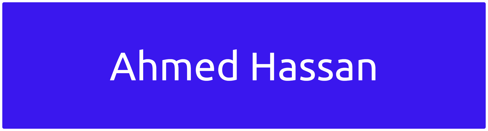

  

<h3 align="center">
AI Engineer • NLP Engineer
</h3>

  

  

# 👋 About Me

🎓 I graduated with a Bachelor's degree in Artificial Intelligence from the **Faculty of Artificial Intelligence**, **Delta University for Science and Technology**, Mansoura, Egypt.

💡 Passionate about building AI-powered applications using **Machine Learning, Deep Learning, NLP, Large Language Models (LLMs), and Retrieval-Augmented Generation (RAG).**

🚀 I enjoy developing scalable AI systems, production-ready FastAPI applications, and intelligent solutions that solve real-world problems.

# 🛠️ Tech Stack

### 💻 Languages

---

### 🤖 AI & Machine Learning

- Model Optimization
- Hyperparameter Tuning

---

### 🧠 Deep Learning

- CNN
- RNN
- LSTM

---

### 💬 NLP & Generative AI

- Semantic Routing
- BGE Reranker
- Contextual Memory 
---

### 👁️ Computer Vision

- Image Processing
- Image Classification
- Feature Extraction
- Transfer Learning
---

### ⚡ Backend & AI Applications

- REST APIs
- AsyncIO
- Interactive AI Interfaces

---

### ☁️ Deployment & DevOps

- Containerization
- Deployment

---

### 📊 Data Science

- Exploratory Data Analysis (EDA)
- Feature Engineering

# 🏆 Featured Projects

## 🌍 Lumeria
### Next-Gen Tourism Experience Using AI & Augmented Reality

> Enterprise-grade RAG Assistant

✨ Features

- FastAPI
- ChromaDB
- Semantic Routing
- Contextual Memory
- BGE Reranker
- Async Concurrency
- Production-ready Architecture

---

## 👴 SafeHaven

### Smart Elderly Care System

AI + IoT based healthcare platform for elderly monitoring.

✔ Real-time Fall Detection

✔ Wearable Sensors

✔ Mobile Notifications

✔ Deep Learning

✔ Machine Learning

✔ IoT

🎯 Accuracy **97%**

---

## 🩸 Leukemia Detection

Deep Learning model for detecting leukemia from microscopic blood cell images.

Technologies

- TensorFlow
- OpenCV
- CNN
- Image Processing

🎯 Accuracy **97.74%**

---

## 🌐 Let's Connect

---

<h3 align="center">
⭐ Thanks for visiting my profile ⭐

</h3>
